# Verified gameplay checkpoints

These screenshots come from the deterministic Playwright regressions. Training radio settings and target motion are authored scenario data; catalog-dependent tests use an isolated local provider fixture.

## Read-only observer truth

In Regional Joint Campaign, the host explicitly grants a joined guest the Game Monitor seat. The observer sees actual Red units and current network topology while an ordinary command role continues to receive only its permitted picture. The browser regression checks reload/reconnect, shared-tab revocation and invalidated streams while paused. Separate cases cover release, logout and restart clearing.

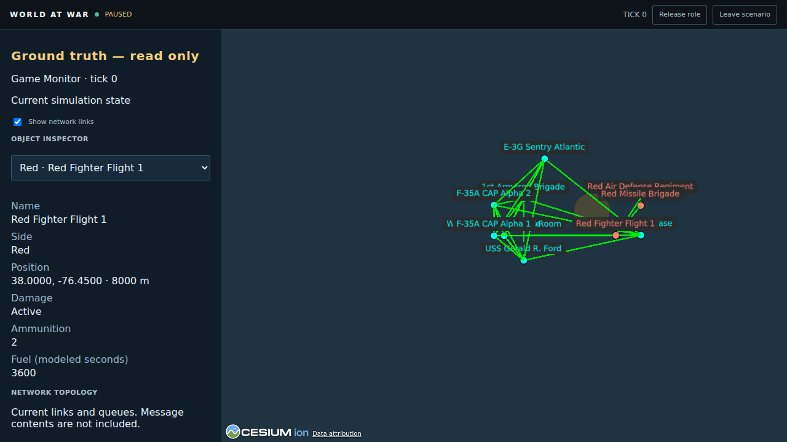

On a phone, the inspector scrolls above the map; neither view overflows the viewport. Background imagery is disabled in the offline fixture.

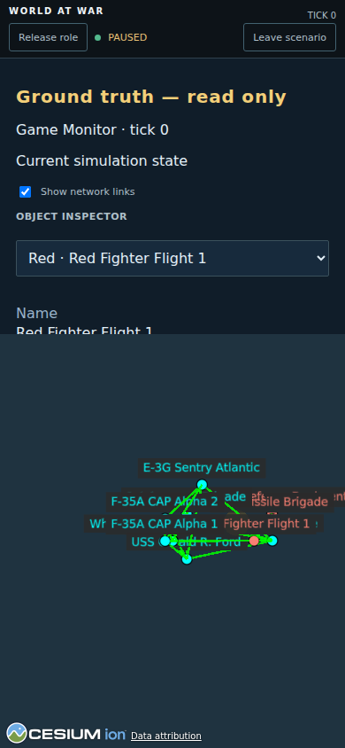

## Radio-delivered execution confirmation

The real-server regression sends a movement order, waits for the aircraft to execute it, then pauses while its reply is still on the shared radio. The commander's receipt continues to say **Delivered; awaiting execution confirmation** and provides no execution tick. The reply is visible at the aircraft's terminal and withheld from the commander's network projection, message detail, REST history, and WebSocket stream.

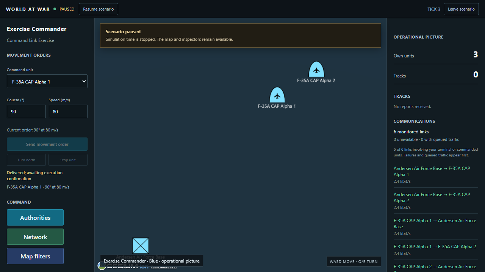

After resume, the acknowledgement arrives. The movement panel shows the original execution tick and the later confirmation receipt tick without sending another command.

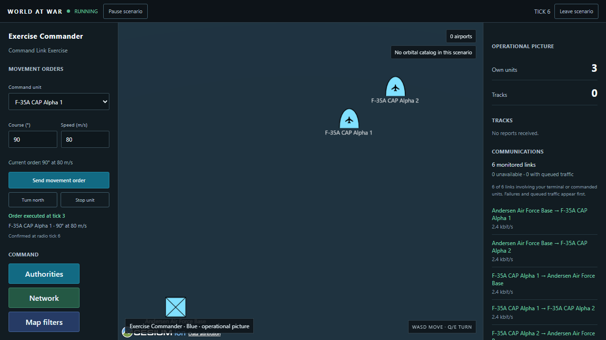

## Contested mission debrief

The real-server regression waits through the initial command-post blackout, compares moving target reports, reacquires the drone during its hold, and sends a firing order. The commander first waits for a radio-delivered launch acknowledgement, with no impact result. The final hit report reaches the command post over the radio after combat time stops. The debrief shows separate observation, delivery, launch, acknowledgement, impact, and report-receipt ticks; its radio history includes the delivered firing order, execution acknowledgement, and impact packet. It also checks stale-lease rejection and a 390-pixel phone layout.

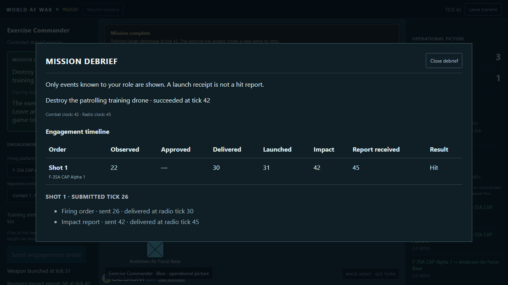

On a phone, the dialog fits the viewport and the timeline scrolls horizontally to retain every timing column.

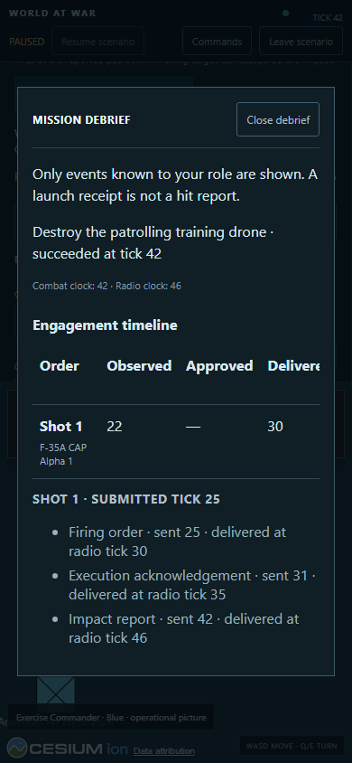

## Delivered firing request

In [Combat Training Exercise](../data/scenarios/combat-training.v1.json), the pilot requests a shot using a local contact report. The commander's **Authorities → Requests** view shows the reported aim point, identity confidence, and observation tick only after the request arrives over the shared radio. Denial consumes no ammunition; approval sends a final firing order that must arrive before launch.

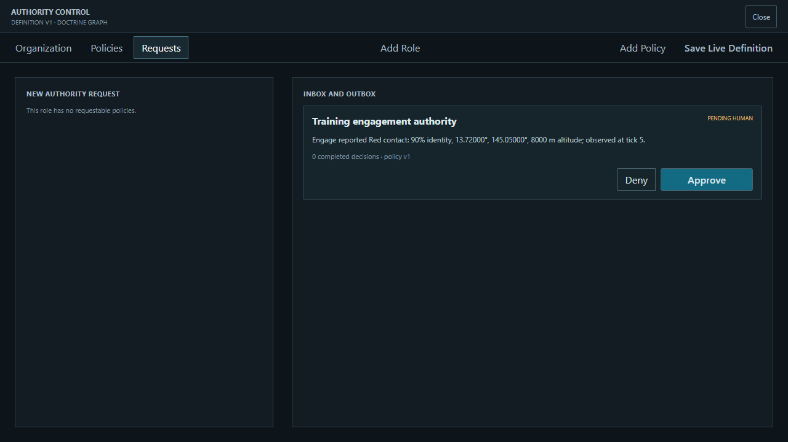

## Completed combat objective

The commander can also order a shot directly from a received contact report. This regression loses the first submission response and retries the same intent, proving that one accepted order launches one weapon. A delayed impact destroys the stationary training target, completes the objective, and pauses the clock. **Weapon launched** is the execution receipt; the public exercise adjudicator supplies the mission result. Local impact telemetry remains at the firing terminal.

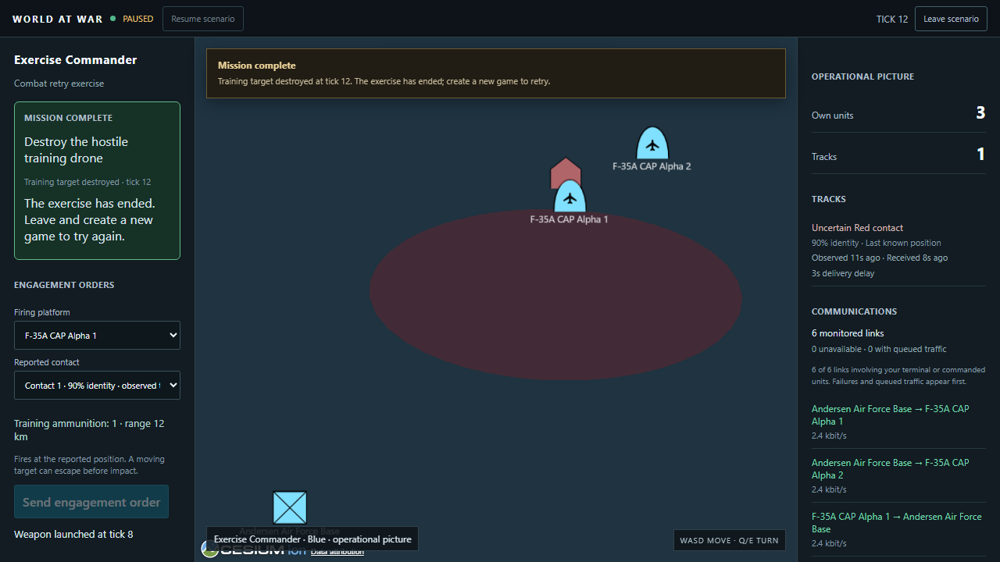

## Delivered sensor knowledge

In [Sensor Relay Exercise](../data/scenarios/sensor-relay-exercise.v1.json), CAP Alpha 1 detects a nearby target locally. The command post learns a snapshot only after its track-report packet arrives. The inspector shows the observation age, receipt age, and delivery delay separately. The snapshot keeps its measured position while the target continues moving.

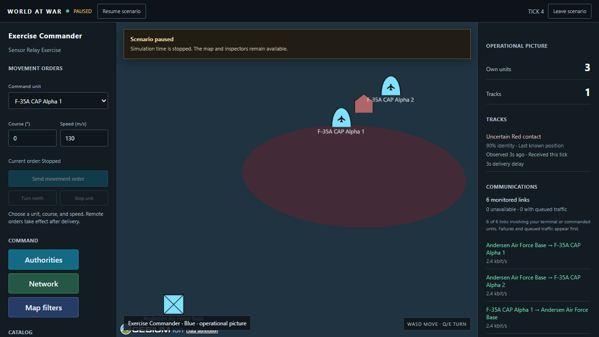

## Executed movement order

The movement controls select a unit, course, and speed. The execution receipt confirms when the delivered and authorized command reached the simulation, after its acknowledgement returns to the issuing terminal. Course changes start a new great-circle arc from the current position, and Stop holds the resulting position.

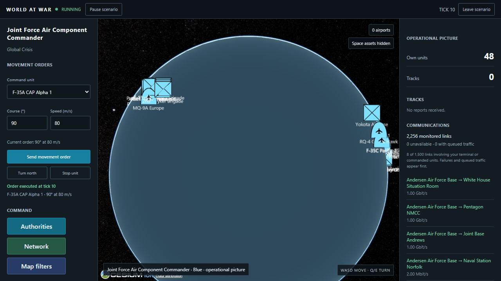

## Focused network inspection

The live network opens with connections involving the issuing terminal. The full 48-terminal scenario shows 94 links in this view instead of 2,256. All connections opens the full role-visible graph, and My terminal restores the focused view. Authorized message history remains available independently of the topology focus.

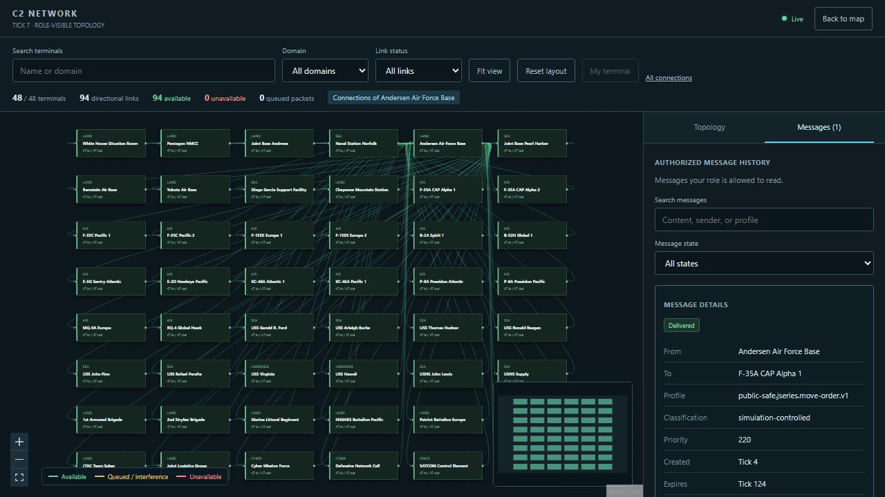

## Map loading and pause

The lobby does not download Cesium until the operational map opens. This regression holds the map module download, pauses the scenario through the still-available host controls, and then allows the map to finish loading. A failed module download offers a reload that restores a current held lease without resuming a paused game.

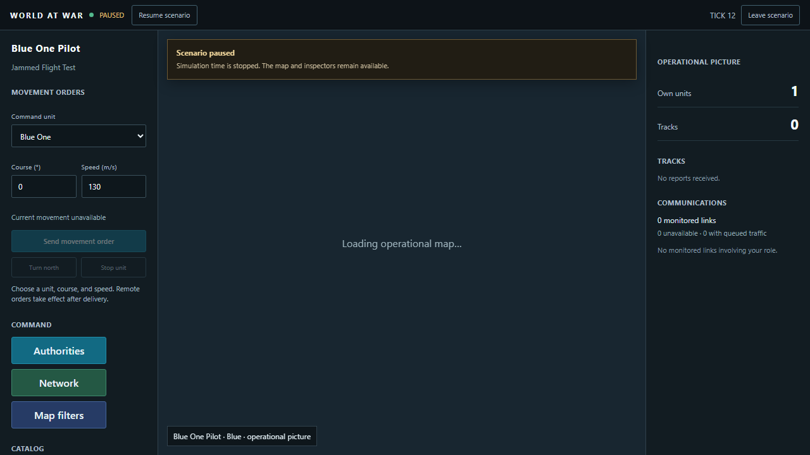

## Reproduce

From `web/`, run `npm run test:e2e` after preparing the pinned sibling c3mesh checkout. The suite builds the Rust server, starts isolated local provider fixtures, and captures fresh screenshots under the ignored `web/test-results/` directory. See [the project README](../README.md) for toolchain and setup commands.
