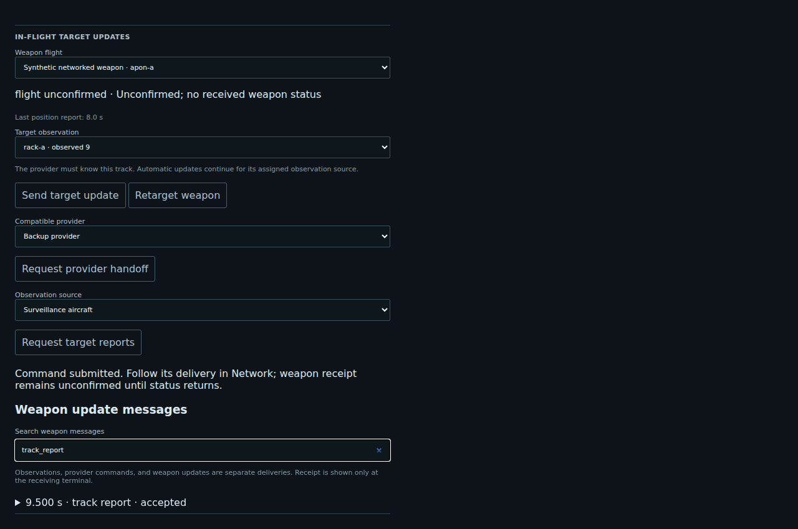

# Fictional in-flight updates

This feature models a game mechanic: observations, commands, and updates take time to cross a network and can fail independently. Equipment, compatibility, movement, acquisition, effect radii, and interference settings are fictional scenario rules. It is not a model of actual weapon performance or operational links. Existing platform names in campaign scenarios do not imply that their assigned training equipment exists in reality.

## Research boundary

The public reference is [RFC 768, User Datagram Protocol](https://www.rfc-editor.org/rfc/rfc768), consulted 2026-10-04. It establishes that datagram delivery and duplicate protection are not guaranteed. That informs the distinction between sending a message and learning that a recipient accepted it. The implementation uses c3mesh messages, not an implementation of the UDP wire format.

This reference does not support any equipment capability claim. The earlier real-weapon compatibility draft has been replaced with fictional presets. Numerical values in the catalog are authored game settings, not values derived from research.

## Play

Choose **In-flight Target Update Exercise** (`iftu-exercise.v1`) in the lobby. It uses the Regional Joint Campaign's role, plan, tasking and firing-authority workflow. Publish and deliver tasking, then use the pilot's combat controls to launch against a received observation. The campaign's configured launchers use fictional projectiles; legacy training scenarios retain their existing abstract combat rules.

Once a flight exists, its launcher sees **In-flight target updates**:

- **Send target update** sends a command to its assigned provider, which needs a matching received observation.
- **Retarget weapon** is available on the updateable training preset.
- **Request provider handoff** sends an assignment through the selected compatible provider to the receiver.
- **Request target reports** asks an observation source to report to that provider. The request itself must arrive before the subscription begins.

Automatic updates use the provider's received observations for the assigned source track. A source report is not an update delivered to the projectile. Changing source tracks requires an explicit retarget; the simulation does not silently correlate unrelated tracks. Track IDs are local to a terminal, so manual updates from another terminal can be rejected if the provider does not know the selected ID.

The exercise adds an abstract final-link interference region at ticks 90–110, independent of the campaign report network. Both updateable presets in the exercise use the fictional direct-link group. Clearing interference permits later packets to arrive; it does not retroactively deliver lost packets.

## Presets and configuration

[data/weapons/catalog.json](../data/weapons/catalog.json) defines five fictional presets: one-way interceptor, two-way updateable projectile, relayed projectile, fixed-destination projectile, and opposing interceptor. Equipment fits explicitly list compatible transmitters and launchable projectiles. They are not selected from real platform names. Frequency numbers serve as interference-group labels in the existing c3mesh model, with no claim about real spectrum use.

[data/scenarios/iftu-campaign.json](../data/scenarios/iftu-campaign.json) assigns training equipment, loadouts, initial providers and report subscriptions. A relayed preset requires an explicit relay entity. Configuration is validated before simulation start. Receiver-less presets retain the launch estimate and do not accept updates.

## Delivery and visibility

Each flight registers temporary endpoints with the existing c3mesh simulator. Queues, shared-medium contention, serialization, latency, distance limits and authored interference apply to those packets. Existing command traffic continues on the same simulator. Registration is atomic; retirement cancels affected traffic without resetting unrelated queues or simulation time. Endpoint identifiers cannot be reused.

Updates carry observation time, source identity, sequence, expiry and assignment revision. The receiver rejects stale, duplicate, expired or unauthorized messages. Provider changes take effect at the receiver only upon assignment delivery. Status traffic uses a separate return path and preserves the original observation timestamp.

The game uses constant-speed movement toward the last delivered estimate and a bounded local acquisition rule. It has no aerodynamic, propulsion, radar waveform, RF power-budget, realistic seeker, or countermeasure model. Impact and lifetime expiry retire network endpoints. Terminal status is not sent after retirement; damage knowledge follows existing observation/report behavior.

The map shows only the launch position or a received position report. A one-way link leaves receipt unconfirmed. Provider identity stays at its last known value until status arrives. Network displays include configured projectile endpoints with **receiver status unknown**, rather than claiming a live link is available. Message histories expose locally sent or locally received events; receiver-side acceptance is not disclosed remotely without a return message. Histories are bounded and memory-resident.

## Validation and dependency

Core regressions cover reports through relays, independent upstream/final-link interference, stale/duplicate/expired updates, assignments under loss, return-status delay, abstract acquisition, endpoint retirement and deterministic replay. Chromium tests cover command payloads and retrying an uncertain request with its original intent ID. Existing campaign browser tests also run against the changed backend.

The implementation requires the companion c3mesh runtime-endpoints change pinned by `c3mesh-revision.txt`. The feature branches are `feature/weapon-iftu` in this repository and `feature/runtime-endpoints` in the sibling checkout. Publish the companion commit before expecting a fresh clone or remote CI to fetch that pin. No remote services or additional runtime data providers are required.
